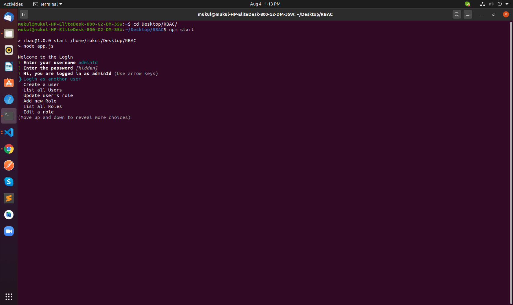

# RBAC(Role Based Access Control)

# NodeJs

 Steps to run the app:  

Step 1) clone the repo. and checkout to main branch
\
\
Step 2) On your terminal run: npm i && npm start
\
\
Step 3) Login as admin : username = adminId , password = 123 or
        Login as normal user : username = userId , password = 123 

To close the app run: ctrl + c

Assumptions:
 1. Admin role can not be edited
 2. Any new user created has 'user' as default role
 3. loggedIn admin can not update roles of himself
 4. userId, role, resource are case-insensitive but pasword is case-sensitive

Here's a sample:

